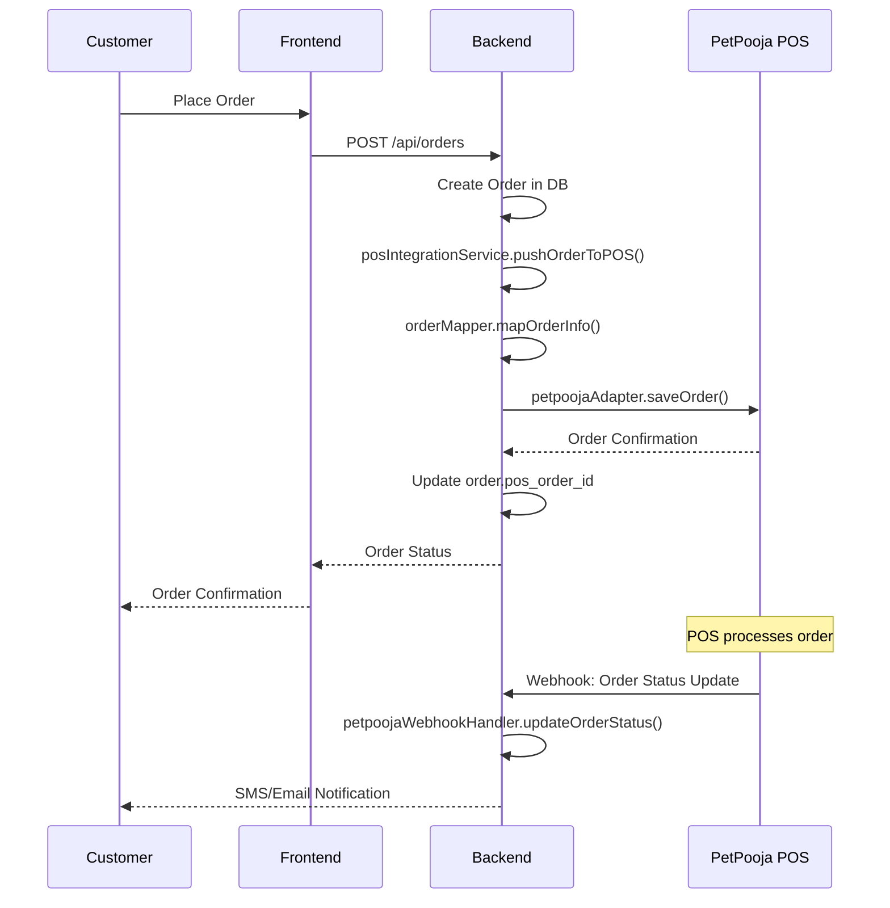
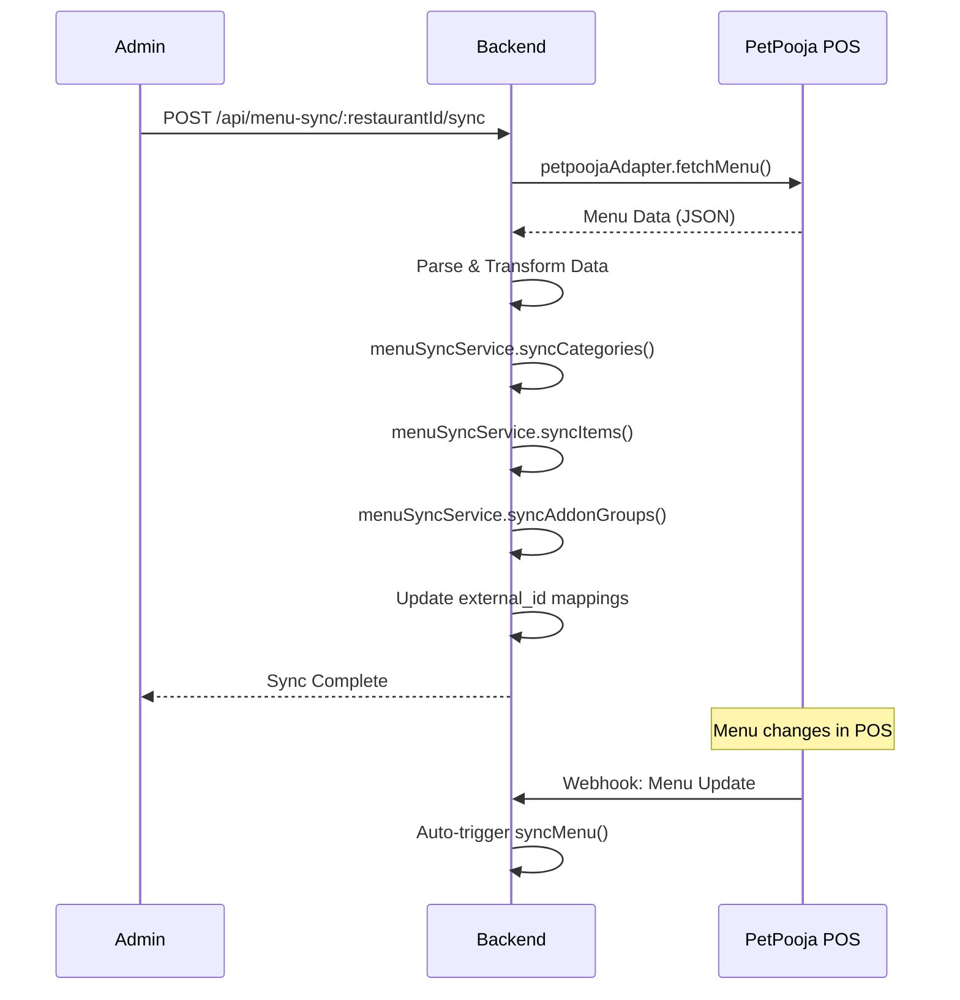
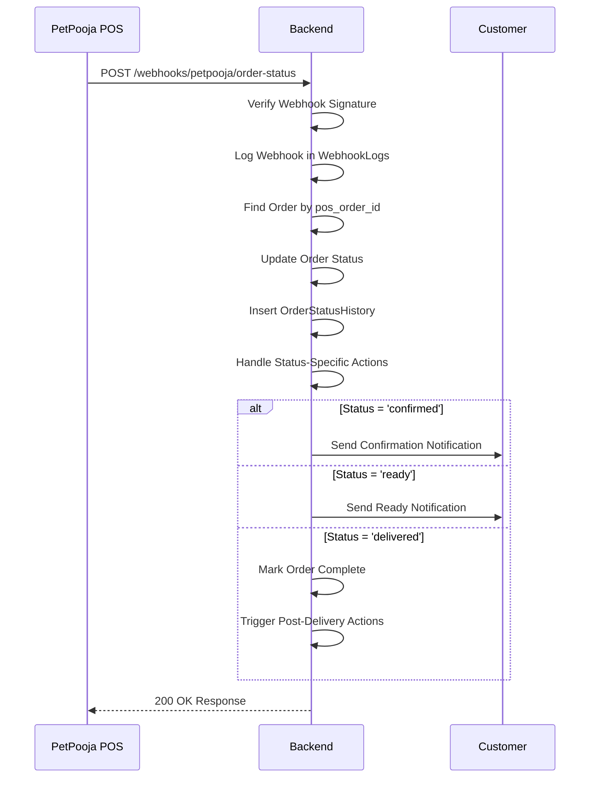

# POS Integration Master Guide
*Complete Documentation for Restaurant POS System Integrations*

## Table of Contents
1. [Architecture Overview](#architecture-overview)
2. [Current Implementation Status](#current-implementation-status)
3. [Database Schema](#database-schema)
4. [Code Structure](#code-structure)
5. [Integration Flows](#integration-flows)
6. [PetPooja Implementation](#petpooja-implementation)
7. [Webhook System](#webhook-system)
8. [Configuration Management](#configuration-management)
9. [Error Handling & Monitoring](#error-handling--monitoring)
10. [Testing Strategy](#testing-strategy)
11. [Deployment Guide](#deployment-guide)
12. [Extensibility Framework](#extensibility-framework)
13. [Troubleshooting](#troubleshooting)

---

## Architecture Overview

### System Architecture Diagram
```
┌─────────────────────────────────────────────────────────────────────────────┐
│                           POS Integration Architecture                       │
├─────────────────────────────────────────────────────────────────────────────┤
│                                                                             │
│  ┌─────────────┐    ┌─────────────────────────────────┐    ┌─────────────┐ │
│  │             │    │           ding-mvp              │    │             │ │
│  │   Frontend  │    │          Backend                │    │   PetPooja  │ │
│  │             │    │                                 │    │     POS     │ │
│  │ - React App │    │ ┌─────────────────────────────┐ │    │             │ │
│  │ - Order UI  │    │ │       API Routes            │ │    │ - Menu API  │ │
│  │ - Menu View │    │ │ - /orders                   │ │    │ - Order API │ │
│  │             │    │ │ - /menu-sync                │ │    │ - Webhooks  │ │
│  └─────────────┘    │ │ - /webhooks/petpooja        │ │    │             │ │
│         │            │└─────────────────────────────┘ │    └─────────────┘ │
│         │            │                                 │           │        │
│         │ HTTP/JSON  │ ┌─────────────────────────────┐ │           │        │
│         ├────────────┤ │     Service Layer           │ │           │        │
│         │            │ │ - posConfigService          │ │◄──────────┤        │
│         │            │ │ - posIntegrationService     │ │   Webhooks│        │
│         │            │ │ - menuSyncService           │ │           │        │
│         │            │ │ - petpoojaWebhookHandler    │ │           │        │
│         │            │ │ - webhookService            │ │           │        │
│         │            │ └─────────────────────────────┘ │           │        │
│         │            │                                 │           │        │
│         │            │ ┌─────────────────────────────┐ │           │        │
│         │            │ │      Adapter Layer          │ │           │        │
│         │            │ │ - petpoojaAdapter           │ │           │        │
│         │            │ │ - orderMapper               │ │───────────┤        │
│         │            │ │ - restaurantMapper          │ │   API     │        │
│         │            │ │ - validator                 │ │   Calls   │        │
│         │            │ └─────────────────────────────┘ │           │        │
│         │            │                                 │           │        │
│         │            │ ┌─────────────────────────────┐ │           │        │
│         │            │ │    Normalized Database      │ │           │        │
│         │            │ │ - pos_providers             │ │           │        │
│         │            │ │ - restaurant_pos_integrations│ │          │        │
│         │            │ │ - restaurant_webhook_secrets│ │           │        │
│         │            │ │ - Orders & OrderItems       │ │           │        │
│         │            │ │ - Restaurants & Menus       │ │           │        │
│         │            │ │ - WebhookLogs & History     │ │           │        │
│         │            │ └─────────────────────────────┘ │           │        │
│         │            └─────────────────────────────────┘           │        │
│         │                                                          │        │
│         └──────────────────────────────────────────────────────────┘        │
│                                Real-time Status Updates                     │
└─────────────────────────────────────────────────────────────────────────────┘
```

### Key Design Principles
- **Normalized**: Database follows normalization principles with provider-level and restaurant-level separation
- **Extensible**: Easy to add new POS providers through normalized provider structure
- **Secure**: Per-restaurant HMAC secrets for webhook verification
- **Robust**: Comprehensive error handling and retry logic
- **Observable**: Full audit trail and monitoring capabilities
- **Scalable**: Database optimized with proper indexing and normalized structure
- **Maintainable**: Clear separation of concerns with modern service architecture

---

## Current Implementation Status

### ✅ Completed Features
- **Normalized Database Architecture**: Provider-based configuration with restaurant-specific overrides
- **Menu Synchronization**: Full two-way sync with PetPooja using normalized structure
- **Order Processing**: Send orders to PetPooja POS with merged configuration
- **Data Mapping**: Transform data between ding format and PetPooja format
- **Configuration Management**: Centralized POS provider management with restaurant-specific configs
- **Error Handling**: Custom error classes and logging
- **Webhook System**: Real-time status updates with proper HMAC signature verification
- **Order Status Tracking**: Complete order lifecycle management
- **Customer Notifications**: SMS/Email notification queue
- **Audit Trail**: Complete history of all operations
- **Secret Management**: Secure webhook secret storage and rotation capability

### 🔄 Integration Points
1. **Menu Sync**: `POST /api/menu-sync/:restaurantId/sync`
2. **Order Processing**: Automatic on order placement using normalized config
3. **Webhook Reception**: `POST /api/webhooks/petpooja/*` with signature verification
4. **Status Updates**: Real-time via webhooks with proper authentication

---

## Database Schema

### Normalized Provider Architecture

#### pos_providers
```sql
CREATE TABLE pos_providers (
    id BIGINT UNSIGNED NOT NULL AUTO_INCREMENT,
    provider_name VARCHAR(50) NOT NULL UNIQUE,       -- 'petpooja', 'toast', 'square'
    display_name VARCHAR(100) NOT NULL,              -- 'PetPooja POS'
    base_api_url VARCHAR(500) NOT NULL,              -- 'https://api.petpooja.com'
    webhook_base_url VARCHAR(500),                   -- 'https://yourapp.com/api/webhooks/petpooja'
    webhook_endpoints JSON,                          -- Webhook endpoint mappings
    global_config JSON,                              -- Provider-level default configuration
    auth_type ENUM('api_key', 'oauth', 'basic') DEFAULT 'api_key',
    is_active BOOLEAN DEFAULT TRUE,
    created_at TIMESTAMP DEFAULT CURRENT_TIMESTAMP,
    updated_at TIMESTAMP DEFAULT CURRENT_TIMESTAMP ON UPDATE CURRENT_TIMESTAMP,
    PRIMARY KEY (id),
    UNIQUE KEY unique_provider_name (provider_name)
);
```

#### restaurant_pos_integrations (Updated)
```sql
CREATE TABLE restaurant_pos_integrations (
    id BIGINT UNSIGNED NOT NULL AUTO_INCREMENT,
    restaurant_id BIGINT UNSIGNED NOT NULL,
    pos_type VARCHAR(50) NOT NULL,                   -- Legacy field for backward compatibility
    pos_provider_id BIGINT UNSIGNED,                 -- References pos_providers.id
    pos_restaurant_id VARCHAR(255),                  -- External restaurant ID in POS
    endpoint VARCHAR(500),                           -- Restaurant-specific endpoint override
    api_key VARCHAR(255),                            -- Restaurant-specific API key
    restaurant_specific_config JSON,                 -- Restaurant-specific configuration overrides
    active BOOLEAN DEFAULT TRUE,
    created_at TIMESTAMP DEFAULT CURRENT_TIMESTAMP,
    updated_at TIMESTAMP DEFAULT CURRENT_TIMESTAMP ON UPDATE CURRENT_TIMESTAMP,
    PRIMARY KEY (id),
    FOREIGN KEY (restaurant_id) REFERENCES Restaurants(id),
    FOREIGN KEY (pos_provider_id) REFERENCES pos_providers(id),
    UNIQUE KEY unique_restaurant_provider (restaurant_id, pos_provider_id),
    INDEX idx_restaurant_pos_active (restaurant_id, active)
);
```

#### restaurant_webhook_secrets
```sql
CREATE TABLE restaurant_webhook_secrets (
    id BIGINT UNSIGNED NOT NULL AUTO_INCREMENT,
    restaurant_id BIGINT UNSIGNED NOT NULL,
    pos_provider_id BIGINT UNSIGNED NOT NULL,
    secret_key VARCHAR(255) NOT NULL,
    is_active BOOLEAN DEFAULT TRUE,
    expires_at TIMESTAMP NULL,
    created_at TIMESTAMP DEFAULT CURRENT_TIMESTAMP,
    updated_at TIMESTAMP DEFAULT CURRENT_TIMESTAMP ON UPDATE CURRENT_TIMESTAMP,
    PRIMARY KEY (id),
    FOREIGN KEY (restaurant_id) REFERENCES Restaurants(id),
    FOREIGN KEY (pos_provider_id) REFERENCES pos_providers(id),
    UNIQUE KEY unique_active_secret (restaurant_id, pos_provider_id, is_active),
    INDEX idx_webhook_secrets_active (is_active, expires_at)
);
```

#### Orders (Enhanced)
```sql
ALTER TABLE Orders 
ADD COLUMN pos_order_id VARCHAR(255) NULL,         -- POS-generated order ID
ADD COLUMN pos_status_updated_at TIMESTAMP NULL,   -- Last status update from POS
ADD COLUMN estimated_delivery_time TIMESTAMP NULL,  -- ETA from POS
ADD COLUMN completed_at TIMESTAMP NULL,            -- Order completion time
ADD COLUMN cancelled_at TIMESTAMP NULL,            -- Cancellation time
ADD COLUMN cancellation_reason VARCHAR(255) NULL;  -- Reason for cancellation
```

#### OrderStatusHistory
```sql
CREATE TABLE OrderStatusHistory (
    id BIGINT UNSIGNED NOT NULL AUTO_INCREMENT,
    order_id BIGINT UNSIGNED NOT NULL,
    old_status VARCHAR(50) NOT NULL,
    new_status VARCHAR(50) NOT NULL,
    changed_by VARCHAR(100) NOT NULL,              -- 'petpooja_webhook', 'admin', etc.
    change_reason TEXT,
    created_at TIMESTAMP DEFAULT CURRENT_TIMESTAMP,
    PRIMARY KEY (id),
    FOREIGN KEY (order_id) REFERENCES Orders(id) ON DELETE CASCADE,
    INDEX idx_order_status_history_order_id (order_id),
    INDEX idx_order_status_history_created_at (created_at)
);
```

#### NotificationQueue
```sql
CREATE TABLE NotificationQueue (
    id BIGINT UNSIGNED NOT NULL AUTO_INCREMENT,
    user_id BIGINT UNSIGNED,
    order_id BIGINT UNSIGNED,
    type VARCHAR(50) NOT NULL,                      -- 'order_confirmed', 'order_ready', etc.
    phone_number VARCHAR(20),
    email VARCHAR(255),
    message TEXT,
    status ENUM('pending', 'sent', 'failed') DEFAULT 'pending',
    retry_count INT DEFAULT 0,
    created_at TIMESTAMP DEFAULT CURRENT_TIMESTAMP,
    updated_at TIMESTAMP DEFAULT CURRENT_TIMESTAMP ON UPDATE CURRENT_TIMESTAMP,
    PRIMARY KEY (id),
    FOREIGN KEY (user_id) REFERENCES Users(id) ON DELETE SET NULL,
    FOREIGN KEY (order_id) REFERENCES Orders(id) ON DELETE CASCADE,
    INDEX idx_notification_queue_status (status),
    INDEX idx_notification_queue_created_at (created_at)
);
```

#### WebhookLogs
```sql
CREATE TABLE WebhookLogs (
    id BIGINT UNSIGNED NOT NULL AUTO_INCREMENT,
    webhook_type VARCHAR(50) NOT NULL,             -- 'order-status', 'menu-update', etc.
    payload JSON NOT NULL,                         -- Complete webhook payload
    status ENUM('success', 'failed') NOT NULL,
    error_message TEXT,
    processed_at TIMESTAMP DEFAULT CURRENT_TIMESTAMP,
    PRIMARY KEY (id),
    INDEX idx_webhook_logs_type (webhook_type),
    INDEX idx_webhook_logs_status (status),
    INDEX idx_webhook_logs_processed_at (processed_at)
);
```

#### MenuSyncHistory
```sql
CREATE TABLE MenuSyncHistory (
    id BIGINT UNSIGNED NOT NULL AUTO_INCREMENT,
    restaurant_id BIGINT UNSIGNED NOT NULL,
    sync_type VARCHAR(50) NOT NULL,                -- 'full', 'partial', 'categories', 'items'
    status ENUM('success', 'failed', 'partial') NOT NULL,
    items_synced INT DEFAULT 0,
    categories_synced INT DEFAULT 0,
    errors JSON,                                   -- Array of error messages
    started_at TIMESTAMP DEFAULT CURRENT_TIMESTAMP,
    completed_at TIMESTAMP NULL,
    PRIMARY KEY (id),
    FOREIGN KEY (restaurant_id) REFERENCES Restaurants(id),
    INDEX idx_menu_sync_history_restaurant (restaurant_id),
    INDEX idx_menu_sync_history_status (status)
);
```

### Menu Schema (with external_id mappings)
- **Categories**: `external_id` maps to PetPooja category ID
- **Items**: `external_id` maps to PetPooja item ID  
- **Variations**: `external_id` maps to PetPooja variation ID
- **AddOnGroups**: `external_id` maps to PetPooja addon group ID
- **AddOnItems**: `external_id` maps to PetPooja addon item ID

---

## Code Structure

### Directory Structure
```
ding-mvp/
├── services/
│   ├── posConfigService.js              # ✅ NEW: Centralized configuration management
│   ├── posIntegrationService.js         # Order processing orchestration
│   ├── menuSyncService.js               # Menu synchronization logic
│   ├── webhookService.js                # ✅ NEW: Webhook signature verification
│   └── webhookHandlers/
│       └── petpoojaWebhookHandler.js    # PetPooja webhook processing
├── services/posAdapters/
│   ├── petpoojaAdapter.js               # PetPooja API communication
│   └── petpooja/
│       ├── mappers/
│       │   ├── orderMapper.js           # Order data transformation
│       │   └── restaurantMapper.js      # Restaurant data transformation
│       └── config/
│           └── validator.js             # Configuration validation
├── routes/
│   ├── petpoojaWebhooks.js             # Webhook endpoints with signature verification
│   ├── menuSync.js                     # Menu sync endpoints
│   └── posIntegration.js               # ✅ UPDATED: Uses normalized structure
└── db_migrations/
    ├── add_webhook_support.sql         # Initial webhook support
    └── complete_normalization.sql      # ✅ NEW: Normalized database structure
```

### Core Components

#### 1. POS Configuration Service (`posConfigService.js`) ⭐ NEW
**Purpose**: Centralized configuration management with provider normalization
```javascript
// Get merged configuration for any POS provider
async function getPosConfiguration(restaurantId, providerName)

// Get PetPooja-specific configuration (backward compatible)
async function getPetpoojaAdapterConfig(restaurantId)

// Create/update integrations with normalized structure
async function createOrUpdatePosIntegration(restaurantId, providerName, integrationData)
```

#### 2. POS Integration Service (`posIntegrationService.js`) ✅ UPDATED
**Purpose**: Orchestrates order processing to POS systems using normalized config
```javascript
// Main function to push order to POS (now uses normalized config)
async function pushOrderToPOS(orderId, connection = null)

// Key responsibilities:
// - Fetch order details and restaurant integration via getPetpoojaAdapterConfig()
// - Transform data using appropriate mapper
// - Call POS adapter with merged configuration
// - Update order status based on response
```

#### 3. Menu Sync Service (`menuSyncService.js`) ✅ UPDATED
**Purpose**: Handles menu synchronization using normalized configuration
```javascript
// Sync complete menu from POS (now uses normalized config)
async function syncMenu(restaurantId)

// Sync individual components:
async function syncCategories(connection, restaurantId, categories)
async function syncItems(connection, restaurantId, items)
async function syncAddonGroups(connection, restaurantId, addonGroups)
```

#### 4. Webhook Service (`webhookService.js`) ⭐ NEW
**Purpose**: Webhook signature verification and configuration management
```javascript
// Get webhook configuration for restaurant and provider
async function getWebhookConfig(restaurantId, providerName)

// Verify webhook signatures using restaurant-specific secrets
async function verifyWebhookSignature(payload, signature, posRestaurantId, providerName)

// Rotate webhook secrets for security
async function rotateWebhookSecret(restaurantId, providerName)
```

#### 5. PetPooja Adapter (`petpoojaAdapter.js`) ✅ COMPATIBLE
**Purpose**: Direct communication with PetPooja APIs (works with both old and new config)
```javascript
// API Methods (compatible with merged configuration):
async function fetchMenu(config)        // Get menu from PetPooja
async function saveOrder(config, orderData)  // Send order to PetPooja
```

#### 6. Webhook Handler (`petpoojaWebhookHandler.js`) ✅ UPDATED
**Purpose**: Process incoming webhooks from PetPooja with signature verification
```javascript
// Main webhook processor with signature verification
async function updateOrderStatus({ order_id, status, pos_order_id, timestamp, restaurant_id })

// Business logic handlers:
async function handleStatusSpecificActions(connection, orderId, status, metadata)
async function notifyCustomer(connection, orderId, notificationType)
```

---

## Integration Flows

### 1. Order Processing Flow


### 2. Menu Sync Flow


### 3. Webhook Processing Flow


---

## PetPooja Implementation

### Configuration Format
```json
{
    "app_key": "nh5xgk8jzr0mwv4qtau26yp3d17bs9ie",
    "app_secret": "71b9cbaa4d866b7bb14668c6f76cd6a2c159aead",
    "access_token": "8c3ce1377b19c2f5da15b1cb4502bdc7344884c1",
    "restID": "your_restaurant_id",
    "restaurant_name_petpooja": "Restaurant Name",
    "restaurant_address_petpooja": "Restaurant Address",
    "restaurant_contact_petpooja": "Restaurant Contact",
    "save_order_endpoint": "https://api.petpooja.com/saveorder",
    "fetch_menu_endpoint": "https://api.petpooja.com/getmenu",
    "udid": "web_device_unique_id",
    "device_type": "WebClient"
}
```

### API Endpoints Used
1. **Fetch Menu**: `POST https://qle1yy2ydc.execute-api.ap-southeast-1.amazonaws.com/V1/mapped_restaurant_menus`
2. **Save Order**: `POST {configured_save_order_endpoint}`
3. **Webhooks**: Configured per restaurant

### Data Mapping

#### Order Status Mapping
```javascript
const STATUS_MAPPING = {
    'CONFIRMED': 'confirmed',
    'PREPARING': 'preparing', 
    'READY': 'ready',
    'DISPATCHED': 'dispatched',
    'DELIVERED': 'delivered',
    'CANCELLED': 'cancelled',
    'REJECTED': 'rejected'
};
```

#### Order Type Mapping
```javascript
const ORDER_TYPE_MAPPING = {
    'DINE_IN': 'D',
    'PICKUP': 'P', 
    'DELIVERY': 'H'
};
```

### Required Fields Validation
- **Order**: customer_name, customer_address, customer_phone, order_id, payment_type, total, items
- **Items**: id, name, price, quantity, AddonItem.details
- **Addons**: id, name, group_id, price, quantity

---

## Webhook System

### Supported Webhooks

#### 1. Order Status Update
**Endpoint**: `POST /api/webhooks/petpooja/order-status`
**Security**: HMAC-SHA256 signature verification using restaurant-specific secrets
**Payload**:
```json
{
    "order_id": "12345",
    "pos_order_id": "PP_67890",
    "status": "CONFIRMED",
    "timestamp": "2024-01-15T10:30:00Z",
    "restaurant_id": "rest_123",
    "signature": "sha256=..." // HMAC signature
}
```

#### 2. Menu Update
**Endpoint**: `POST /api/webhooks/petpooja/menu-update`
**Payload**:
```json
{
    "restaurant_id": "rest_123",
    "items_updated": ["item_1", "item_2"],
    "timestamp": "2024-01-15T10:30:00Z"
}
```

#### 3. Inventory Update
**Endpoint**: `POST /api/webhooks/petpooja/inventory-update`
**Payload**:
```json
{
    "restaurant_id": "rest_123",
    "item_id": "item_1",
    "availability": true,
    "timestamp": "2024-01-15T10:30:00Z"
}
```

### Webhook Security
```javascript
// Real HMAC-SHA256 signature verification
const { verifyWebhookSignature } = require('../services/webhookService');

async function verifyWebhook(req, res, next) {
    const signature = req.headers['x-petpooja-signature'];
    const payload = req.body;
    const posRestaurantId = payload.restaurant_id;
    
    const isValid = await verifyWebhookSignature(
        payload, 
        signature, 
        posRestaurantId, 
        'petpooja'
    );
    
    if (!isValid) {
        return res.status(401).json({ error: 'Invalid signature' });
    }
    
    next();
}
```

---

## Configuration Management

### Normalized Configuration Architecture

The new architecture separates concerns between:
1. **Provider-level configuration**: Shared settings for all restaurants using a POS provider
2. **Restaurant-specific configuration**: Overrides and custom settings per restaurant
3. **Webhook secrets**: Secure per-restaurant authentication

### Configuration Merging
```javascript
// Example: Getting merged PetPooja configuration
const { integration, config } = await getPetpoojaAdapterConfig(restaurantId);

// The merged config combines:
// 1. Provider defaults from pos_providers.global_config
// 2. Restaurant overrides from restaurant_pos_integrations.restaurant_specific_config
// 3. Core integration fields (restID, endpoints, etc.)
```

### Provider Configuration Example
```json
{
    "app_key": "nh5xgk8jzr0mwv4qtau26yp3d17bs9ie",
    "app_secret": "71b9cbaa4d866b7bb14668c6f76cd6a2c159aead",
    "access_token": "8c3ce1377b19c2f5da15b1cb4502bdc7344884c1",
    "device_type": "WebClient",
    "udid_prefix": "web_"
}
```

### Restaurant-Specific Overrides
```json
{
    "restaurant_name_petpooja": "Custom Restaurant Name",
    "restaurant_address_petpooja": "Custom Address",
    "restaurant_contact_petpooja": "Custom Contact",
    "udid": "custom_web_device_id_123",
    "custom_settings": {
        "enable_auto_accept": true,
        "notification_preferences": ["sms", "email"]
    }
}
```

### Webhook Configuration
```json
{
    "order-status": "/order-status",
    "menu-update": "/menu-update", 
    "inventory-update": "/inventory-update"
}
```

### Environment Variables
```env
# Webhook Configuration
WEBHOOK_BASE_URL=https://yourapp.com/api/webhooks/petpooja

# Database Configuration
DB_HOST=localhost
DB_USER=your_user
DB_PASSWORD=your_password
DB_NAME=your_database
```

### Configuration API ✅ UPDATED
```javascript
// Get normalized integration config
GET /api/pos-config/:restaurantId/:providerName

// Create/Update integration with normalized structure
POST /api/pos-integration/:restaurantId
{
    "provider_name": "petpooja",
    "pos_restaurant_id": "your_petpooja_rest_id",
    "endpoint": "custom_endpoint_override",
    "api_key": "restaurant_specific_key",
    "restaurant_config": { ... },
    "webhook_secret": "unique_secret_per_restaurant"
}

// Test integration
POST /api/pos-integration/:restaurantId/test

// Rotate webhook secret
POST /api/pos-integration/:restaurantId/:providerName/rotate-secret
```

---

## Error Handling & Monitoring

### Custom Error Classes
```javascript
class PetPoojaError extends Error {
    constructor(message, code, details) {
        super(message);
        this.name = 'PetPoojaError';
        this.code = code;
        this.details = details;
    }
}

class MenuSyncError extends Error {
    constructor(message, code, details) {
        super(message);
        this.name = 'MenuSyncError';
        this.code = code;
        this.details = details;
    }
}
```

### Logging Strategy
1. **WebhookLogs**: All webhook calls logged with payload and response
2. **OrderStatusHistory**: Complete audit trail of status changes
3. **MenuSyncHistory**: Track all sync operations
4. **Console Logging**: Structured logging for debugging

### Retry Logic
- **Order Processing**: 3 retries with exponential backoff
- **Webhook Processing**: Queue failed webhooks for retry
- **Menu Sync**: Automatic retry on partial failures

### Monitoring Endpoints
```javascript
// Health check
GET /api/pos-integration/health

// Integration status
GET /api/pos-integration/:restaurantId/status

// Webhook logs
GET /api/webhooks/logs?type=petpooja&status=failed
```

---

## Testing Strategy

### 1. Unit Tests
```javascript
// Test PetPooja adapter
describe('PetPoojaAdapter', () => {
    test('fetchMenu should return valid menu data', async () => {
        // Test implementation
    });
    
    test('saveOrder should send order successfully', async () => {
        // Test implementation
    });
});

// Test mappers
describe('OrderMapper', () => {
    test('mapOrderInfo should transform order correctly', () => {
        // Test implementation
    });
});
```

### 2. Integration Tests
```javascript
// End-to-end order flow
describe('Order Integration', () => {
    test('complete order flow with PetPooja', async () => {
        // 1. Create order
        // 2. Push to POS
        // 3. Verify status update
        // 4. Test webhook processing
    });
});
```

### 3. Webhook Testing
```javascript
// Mock webhook calls
describe('Webhook Processing', () => {
    test('order status webhook should update order', async () => {
        const webhookPayload = {
            order_id: 'test_123',
            status: 'CONFIRMED',
            pos_order_id: 'PP_456'
        };
        
        const response = await request(app)
            .post('/api/webhooks/petpooja/order-status')
            .send(webhookPayload);
            
        expect(response.status).toBe(200);
        // Verify order status updated
    });
});
```

### 4. Load Testing
- **Concurrent Orders**: Test multiple orders processing simultaneously
- **Webhook Volume**: Handle high-volume webhook calls
- **Menu Sync**: Large menu synchronization performance

---

## Deployment Guide

### 1. Database Migration
```bash
# Run the complete normalization migration
mysql -u username -p database_name < db_migrations/complete_normalization.sql

# Verify provider setup
mysql -u username -p database_name -e "SELECT * FROM pos_providers WHERE provider_name = 'petpooja';"
```

### 2. Environment Setup
```bash
# Install dependencies
npm install

# Set environment variables
export WEBHOOK_BASE_URL=https://yourapp.com/api/webhooks/petpooja

# Start application
npm start
```

### 3. PetPooja Provider Setup
```sql
-- Insert PetPooja provider configuration
INSERT INTO pos_providers (
    provider_name, display_name, base_api_url, webhook_base_url,
    webhook_endpoints, global_config, auth_type, is_active
) VALUES (
    'petpooja',
    'PetPooja POS',
    'https://qle1yy2ydc.execute-api.ap-southeast-1.amazonaws.com/V1',
    'https://yourapp.com/api/webhooks/petpooja',
    '{"order-status": "/order-status", "menu-update": "/menu-update", "inventory-update": "/inventory-update"}',
    '{"app_key": "nh5xgk8jzr0mwv4qtau26yp3d17bs9ie", "app_secret": "71b9cbaa4d866b7bb14668c6f76cd6a2c159aead", "access_token": "8c3ce1377b19c2f5da15b1cb4502bdc7344884c1", "device_type": "WebClient"}',
    'api_key',
    1
);
```

### 4. Restaurant Integration Setup
```javascript
// Use the normalized API
const integrationData = {
    provider_name: 'petpooja',
    pos_restaurant_id: 'your_petpooja_rest_id',
    endpoint: null, // Use provider default
    api_key: 'restaurant_specific_key',
    restaurant_config: {
        restaurant_name_petpooja: 'Restaurant Name',
        restaurant_address_petpooja: 'Restaurant Address',
        restaurant_contact_petpooja: 'Restaurant Contact'
    },
    webhook_secret: crypto.randomBytes(32).toString('hex')
};

await createOrUpdatePosIntegration(restaurantId, 'petpooja', integrationData);
```

### 5. Test Integration
```bash
# Test menu sync with normalized config
curl -X POST http://localhost:5010/api/menu-sync/1/sync

# Test webhook with signature verification
curl -X POST http://localhost:5010/api/webhooks/petpooja/order-status \
  -H "Content-Type: application/json" \
  -H "x-petpooja-signature: sha256=calculated_hmac_signature" \
  -d '{"order_id":"123","status":"CONFIRMED","restaurant_id":"1"}'
```

---

## Extensibility Framework

### Adding New POS Integrations

#### 1. Create New Adapter
```javascript
// services/posAdapters/newPosAdapter.js
async function fetchMenu(config) {
    // Implement new POS menu fetch
}

async function saveOrder(config, orderData) {
    // Implement new POS order save
}

module.exports = { fetchMenu, saveOrder };
```

#### 2. Create Mappers
```javascript
// services/posAdapters/newpos/mappers/orderMapper.js
function mapOrderInfo(orderData, restaurantConfig) {
    // Transform order data to new POS format
}
```

#### 3. Update Integration Service
```javascript
// services/posIntegrationService.js
switch (integration.pos_type.toLowerCase()) {
    case 'petpooja':
        response = await saveOrder(integration.config, orderInputData);
        break;
    case 'newpos':
        const newPosAdapter = require('./posAdapters/newPosAdapter');
        response = await newPosAdapter.saveOrder(integration.config, orderInputData);
        break;
    default:
        throw new Error(`Unsupported POS type: ${integration.pos_type}`);
}
```

#### 4. Add Webhook Handler
```javascript
// services/webhookHandlers/newPosWebhookHandler.js
async function updateOrderStatus(webhookData) {
    // Handle new POS webhook format
}
```

### Configuration Schema
Each POS type should define its configuration schema:
```javascript
// services/posAdapters/schemas/petpoojaSchema.js
const configSchema = {
    required: ['app_key', 'app_secret', 'access_token', 'restID'],
    optional: ['save_order_endpoint', 'udid', 'device_type']
};
```

---

## Troubleshooting

### Common Issues

#### 1. Order Not Sent to POS
**Symptoms**: Order created but not appearing in POS
**Debugging**:
```sql
-- Check integration config
SELECT * FROM restaurant_pos_integrations WHERE restaurant_id = ? AND active = 1;

-- Check order POS status
SELECT id, status, pos_order_id, created_at FROM Orders WHERE id = ?;

-- Check webhook logs
SELECT * FROM WebhookLogs WHERE JSON_EXTRACT(payload, '$.order_id') = ? ORDER BY processed_at DESC;
```

#### 2. Menu Sync Failures
**Symptoms**: Menu not updating from POS
**Debugging**:
```sql
-- Check sync history
SELECT * FROM MenuSyncHistory WHERE restaurant_id = ? ORDER BY started_at DESC;

-- Check external ID mappings
SELECT name, external_id FROM Items WHERE restaurant_id = ? AND external_id IS NULL;
```

#### 3. Webhook Processing Errors
**Symptoms**: Status updates not reflecting
**Debugging**:
```sql
-- Check webhook logs
SELECT * FROM WebhookLogs WHERE status = 'failed' ORDER BY processed_at DESC;

-- Check order status history
SELECT * FROM OrderStatusHistory WHERE order_id = ? ORDER BY created_at DESC;
```

### Debug Mode
Enable detailed logging:
```javascript
// Set environment variable
DEBUG=pos:*

// Or in code
console.log('PetPooja API Request:', JSON.stringify(payload, null, 2));
console.log('PetPooja API Response:', JSON.stringify(response.data, null, 2));
```

### Health Checks
```javascript
// Check POS connectivity
GET /api/pos-integration/:restaurantId/health

// Response format:
{
    "status": "healthy",
    "pos_type": "petpooja",
    "last_sync": "2024-01-15T10:30:00Z",
    "webhook_status": "active",
    "recent_errors": []
}
```

---

## Performance Optimization

### Database Indexing
```sql
-- Critical indexes for performance
CREATE INDEX idx_orders_restaurant_status ON Orders(restaurant_id, status);
CREATE INDEX idx_orders_pos_order_id ON Orders(pos_order_id);
CREATE INDEX idx_items_external_restaurant ON Items(external_id, restaurant_id);
CREATE INDEX idx_webhook_logs_processed_at ON WebhookLogs(processed_at DESC);
```

### Caching Strategy
```javascript
// Cache menu data
const menuCache = new Map();
const CACHE_TTL = 5 * 60 * 1000; // 5 minutes

async function getCachedMenu(restaurantId) {
    const cacheKey = `menu_${restaurantId}`;
    const cached = menuCache.get(cacheKey);
    
    if (cached && Date.now() - cached.timestamp < CACHE_TTL) {
        return cached.data;
    }
    
    // Fetch from database
    const menu = await fetchMenuFromDB(restaurantId);
    menuCache.set(cacheKey, { data: menu, timestamp: Date.now() });
    return menu;
}
```

### Queue Management
```javascript
// Process notifications in queue
const notificationQueue = [];

async function processNotificationQueue() {
    while (notificationQueue.length > 0) {
        const notification = notificationQueue.shift();
        try {
            await sendNotification(notification);
        } catch (error) {
            console.error('Notification failed:', error);
            // Re-queue with retry logic
        }
    }
}

// Run every 30 seconds
setInterval(processNotificationQueue, 30000);
```

---

## Security Considerations

### Webhook Security
1. **Signature Verification**: Always verify webhook signatures
2. **IP Whitelisting**: Restrict webhook sources to known IPs
3. **Rate Limiting**: Prevent webhook abuse
4. **Payload Validation**: Validate all incoming data

### Data Protection
1. **API Key Encryption**: Encrypt stored API keys
2. **Audit Logging**: Log all POS operations
3. **Access Control**: Restrict POS configuration access
4. **Data Sanitization**: Clean all data before POS transmission

### Configuration Security
```javascript
// Encrypt sensitive config data
const crypto = require('crypto');

function encryptConfig(config, secret) {
    const cipher = crypto.createCipher('aes-256-cbc', secret);
    let encrypted = cipher.update(JSON.stringify(config), 'utf8', 'hex');
    encrypted += cipher.final('hex');
    return encrypted;
}

function decryptConfig(encryptedConfig, secret) {
    const decipher = crypto.createDecipher('aes-256-cbc', secret);
    let decrypted = decipher.update(encryptedConfig, 'hex', 'utf8');
    decrypted += decipher.final('utf8');
    return JSON.parse(decrypted);
}
```

---

## Conclusion

The POS integration system has been fully modernized with a normalized database architecture that provides:

- ✅ **Scalable Provider Management**: Easy to add new POS systems
- ✅ **Enhanced Security**: Per-restaurant webhook secrets with HMAC verification
- ✅ **Improved Maintainability**: Centralized configuration with restaurant-specific overrides
- ✅ **Production Ready**: Comprehensive error handling, monitoring, and audit trails
- ✅ **Future Proof**: Extensible architecture for multiple POS providers

The system is now production-ready and provides a solid foundation for restaurant operations with robust POS integration capabilities across multiple providers.

---

*Last Updated: 2025-06-15*  
*Version: 2.0 - Normalized Architecture*  
*Author: ding Development Team* 